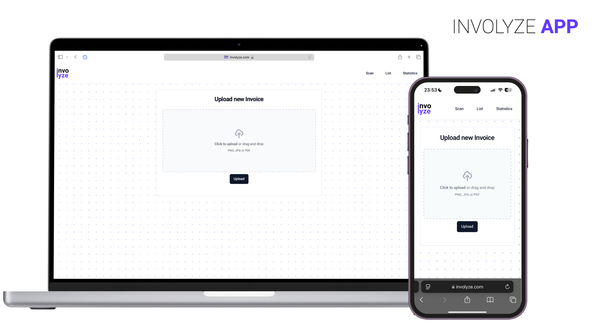
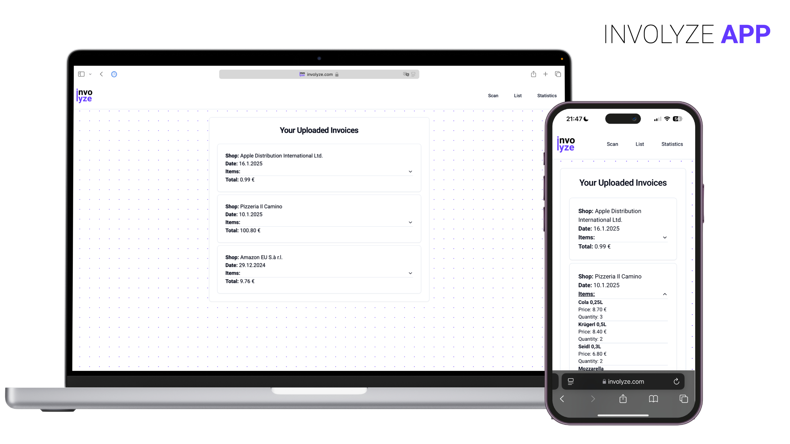
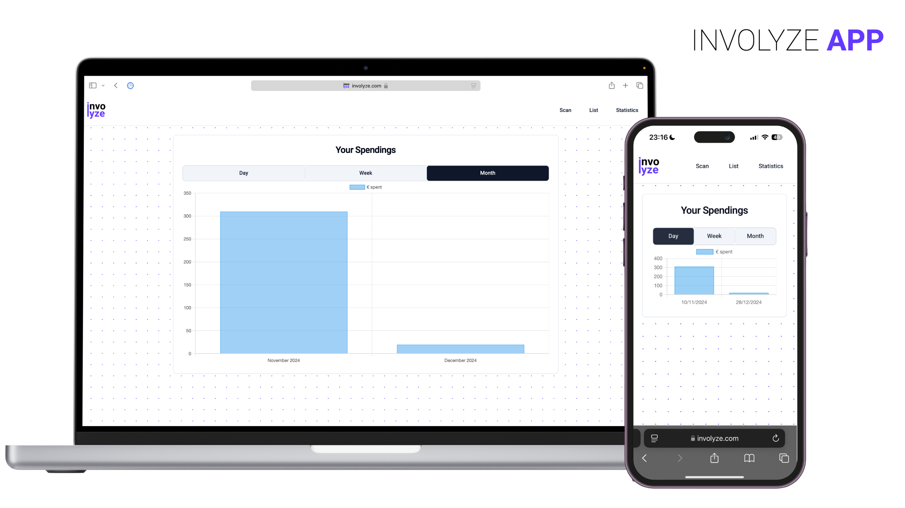
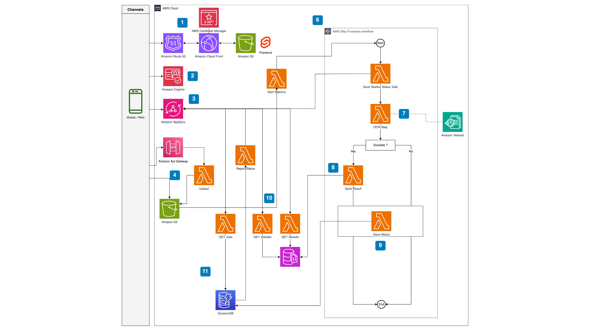
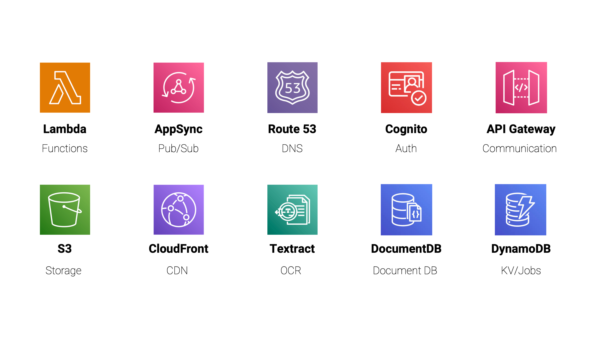

# Involyze

**Serverless Invoice Analysis Platform**

A proof-of-concept serverless application developed as part of the Serverless Computing course at TU Wien (Vienna University of Technology). Involyze demonstrates a fully automated, scale-to-zero architecture for processing and analyzing invoice documents using AWS cloud services.

> ⚠️ **Note:** This repository is a public mirror created for showcase purposes. The original development was conducted in an internal repository.


## Overview


## Key Features

### 1. **Document Upload & Processing**
Users can upload invoices via drag-and-drop or file selection. The system queues the document and provides real-time status updates throughout the processing pipeline.



### 2. **Automated OCR Pipeline**
AWS Textract performs optical character recognition to extract structured data from unstructured invoice images. The pipeline validates results and stores successfully processed invoices in DocumentDB.

### 3. **Results Dashboard**
View all processed invoices with expandable item details, sorted chronologically. Each invoice displays extracted metadata and line-item breakdowns.



### 4. **Spending Analytics**
Generate spending statistics with configurable time granularity (daily, weekly, monthly). Visualize expense trends through interactive charts.




## Architecture

Involyze implements a fully serverless, event-driven architecture on AWS:



1. **Frontend Hosting** (**#1**)
   - Static Svelte application hosted on **Amazon S3**
   - Distributed globally via **Amazon CloudFront** CDN
   - SSL/TLS certificates managed by **AWS Certificate Manager**
   - Custom domain routing via **Amazon Route 53**

2. **Authentication** (**#2**)
   - User authentication powered by **Amazon Cognito**
   - OAuth 2.0 authorization code flow
   - JWT token-based session management

3. **Real-time Communication** (**#3**)
   - **AWS AppSync** GraphQL API for queries and subscriptions
   - WebSocket connections for live status updates
   - Pub/Sub model for job status notifications

4. **File Upload** (**#4**)
   - Pre-signed URL generation via **API Gateway** + **Lambda**
   - Direct client-to-S3 uploads to **Amazon S3** invoice bucket

5. **Processing Pipeline** (**#6-9**)
   - **S3 Event Notification** triggers Lambda function
   - **AWS Step Functions** orchestrates the workflow:
     - **SaveStartedStatus** → Update DynamoDB with "STARTED" state
     - **OCRStep** → AWS Textract analyzes document
     - **Conditional Branch** → Success/failure routing
     - **SaveResult** → Store parsed invoice in DocumentDB
     - **SaveCompletedStatus/SaveFailedStatus** → Final status update

6. **Status Updates** (**#10**)
   - **DynamoDB Streams** trigger Lambda on status changes
   - **ReportStatus** Lambda pushes GraphQL mutations to AppSync
   - Clients receive real-time updates via subscriptions

7. **Data Retrieval** (**#11**)
   - **GetResults** Lambda queries DocumentDB for invoice history
   - **GetStatistics** Lambda aggregates spending data by time periods
   - **GetJobs** Lambda fetches processing status from DynamoDB


## AWS Services Used



| Service | Purpose |
|---------|---------|
| **Lambda** | Serverless compute for all backend functions |
| **AppSync** | Managed GraphQL API with real-time subscriptions |
| **Route 53** | DNS management and domain routing |
| **Cognito** | User authentication and authorization |
| **API Gateway** | REST API for upload URL generation |
| **S3** | Storage for frontend assets and invoice documents |
| **CloudFront** | CDN for global content delivery |
| **Textract** | OCR service for invoice data extraction |
| **DocumentDB** | MongoDB-compatible document database for invoices |
| **DynamoDB** | Key-value store for job status tracking |
| **Step Functions** | Workflow orchestration for processing pipeline |
| **Certificate Manager** | SSL/TLS certificate provisioning |


## Processing Pipeline Details

### Step Functions Workflow

The core processing logic is implemented as an AWS Step Functions state machine:

```
Start → SaveStartedStatus → OCRStep → [Success Check]
                                            ├─ Yes → SaveResult → SaveCompletedStatus → End
                                            └─ No → SaveFailedStatus → End
```

**State Definitions:**

- **SaveStartedStatus**: Records job initiation timestamp and state in DynamoDB
- **OCRStep**: Invokes AWS Textract `AnalyzeExpense` API to extract:
  - Vendor name fields (highest confidence selection)
  - Invoice date (parsed using `chrono-node` for multiple locales)
  - Line items (name, quantity, price)
- **Success Check**: Validates that shop name exists and items array is non-empty
- **SaveResult**: Writes structured invoice document to DocumentDB with indexes on:
  - `shop` (ascending)
  - `createdAt` (descending)
  - `shop + createdAt` (compound)
  - `items.name` (text search)
- **SaveCompletedStatus/SaveFailedStatus**: Updates DynamoDB job status

## Project Structure

The project is composed of the following components:

- [Functions](functions): Subproject where lambdas are implemented
- [Infrastructure](infrastructure): IAC description of the project, including setup postprocessing.
- [involyze-app](involyze-app): A Svelte Frontend interacting with the serverless backend.
- [Tests](tests): Contains test data that was used in evaluating the metrics.


### Lambda Functions

| Function | Trigger | Description |
|----------|---------|-------------|
| `Upload` | API Gateway POST | Generates pre-signed S3 PUT URL with 1-hour expiry |
| `StartPipeline` | S3 Object Created | Extracts userId from key prefix and starts Step Functions execution |
| `SaveStatus` | Step Functions Task | Writes progress state to DynamoDB (`PENDING`/`STARTED`/`COMPLETED`/`FAILED`) |
| `OCRStep` | Step Functions Task | Processes invoice with Textract, parses dates with German/English locale support |
| `SaveResult` | Step Functions Task | Inserts validated invoice into DocumentDB |
| `ReportStatus` | DynamoDB Stream | Signs and sends AppSync GraphQL mutation for real-time notification |
| `GetResults` | AppSync Resolver | Queries DocumentDB with optional `jobId` filter |
| `GetStatistics` | AppSync Resolver | Aggregates expenses by Day/Week/Month using MongoDB aggregation pipeline |
| `GetJobs` | AppSync Resolver | Scans DynamoDB for all job statuses |


## Infrastructure

The entire stack is defined using **AWS CDK** (Cloud Development Kit) in TypeScript:

- **`InvoiceProcessingStack`**: Root stack coordinating all constructs
- **`InvolyzeCognito`**: User pool, domain, and OAuth client configuration
- **`AppSiteBucket`**: S3 bucket with OAI for CloudFront
- **`AppCloudfront`**: Distribution with custom domain and SSL
- **`InvoiceBucket`**: S3 bucket with CORS for client uploads
- **`DocumentDB`**: VPC-isolated MongoDB cluster with secret rotation
- **`DocumentPipeline`**: Step Functions workflow and Lambda triggers
- **`DocumentRestApi`**: API Gateway with Cognito authorizer
- **`DocumentGraphqlApi`**: AppSync schema, resolvers, and data sources
- **`DocumentDynamo`**: DynamoDB table with stream enabled


## Deployment

## Environment

Create a `.env` file in the project root with the following environment variables.

````
ACCOUNT_ID=<<ID>>
AWS_ACCESS_KEY_ID=<<KEY>>
AWS_SECRET_ACCESS_KEY=<<KEY>>
AWS_REGION=eu-central-1
COGNITO_PREFIX=involyze
COGNITO_SELF_SIGNUP_ENABLED=<<Set to true to enable self signup>>
CERTIFICATE_ARN=<<ARN or empty to not use static domain>>
HOSTED_ZONE_ID=<<id or empty to not use static domain>>
DOMAIN_NAME=<<domain or empty to not use static domain>>
````

## Deployment Commands

If not already done, bootstrap your AWS to work with the CDK:

````bash
npm run bootstrap
````


For a full build using the following command suffices:

````bash
npm run pipeline
````

## Additional optional commands


To only build all parts:
````bash
npm run build
````


To only deploy all parts:
````bash
npm run deploy
````

To only do postprocessing for all deployed parts:
````bash
npm run postprocessing
````

## Update or Rollback Failed

In the case an update or rollback failed it might happen that the stack is in a kinda unrecoverable state. 
We tried to delete the whole stack but this operation also was hard-stuck. 

In the end we tracked down the halting-deletion to a security-group that could not be deleted,
because there was network interface that was still in use. 

You can list the network-interfaces with `aws ec2 describe-network-interfaces` and delete one of them with `aws ec2 delete-network-interface --network-interface-id <id>`.
The interface id can be fetched from the web-interface and from `describe-network-interfaces`.


## Technical Highlights


### Fully Automated Deployment

We use a fully automated deployment pipeline that solves a challenge not automatically handled by AWS: bridging infrastructure and application code through runtime configuration injection. The system addresses the **chicken-and-egg problem** where frontend applications need infrastructure outputs (API URLs, Cognito client IDs, GraphQL endpoints) that only exist after deployment. Our solution uses a three-stage approach: 

1. build the frontend with template placeholders like `{{UPLOADAPIURL}}`, 
2. deploy the CDK stack which creates all AWS resources and exports CloudFormation outputs, and 
3. execute a custom post-processing script that fetches these outputs via the AWS SDK, reads the deployed `index.html` from S3, performs string replacement to inject actual values, writes the updated file back, and invalidates the CloudFront cache.

This approach enables true **single-command deployment** via `git push`, eliminates manual configuration steps, ensures environment parity across dev/staging/production, and maintains type safety through CDK's output validation; all without requiring multiple deployment stages or separate frontend/backend pipelines that developers would otherwise need to orchestrate manually.

### Real-time Notification Architecture

**DynamoDB Streams → Lambda → AppSync Mutation:**

1. `SaveStatus` Lambda writes to DynamoDB
2. DynamoDB Stream triggers `ReportStatus` Lambda
3. Lambda signs GraphQL request using SigV4:
   ```typescript
   const signer = new SignatureV4({
     credentials: defaultProvider(),
     region: REGION,
     service: 'appsync',
     sha256: Sha256,
   });
   const signedRequest = await signer.sign(new HttpRequest({
     method: 'POST',
     body: JSON.stringify({ query: mutation, variables }),
   }));
   ```
4. AppSync broadcasts to subscribed clients via WebSocket


## Contributions

This project was developed in collaboration with an exceptional team, consisting of:

* [Michael Helcig](https://github.com/helcig)


## Scalability & Performance

- **Cold start mitigation**: Lambda functions use Node.js 22 runtime with minimal dependencies
- **CDN caching**: CloudFront serves static assets with edge caching
- **Scale-to-zero**: All compute resources automatically scale down during inactivity
- **Concurrent execution**: Step Functions can process multiple invoices in parallel

**Measured Performance:**
- Upload → OCR completion: ~8-15 seconds (depending on document complexity)
- Statistics query (100 invoices): ~200ms
- Frontend initial load (cached): <500ms


**Built with ❤️ in 🇦🇹 at TU Wien as part of the Serverless Computing Course.**
